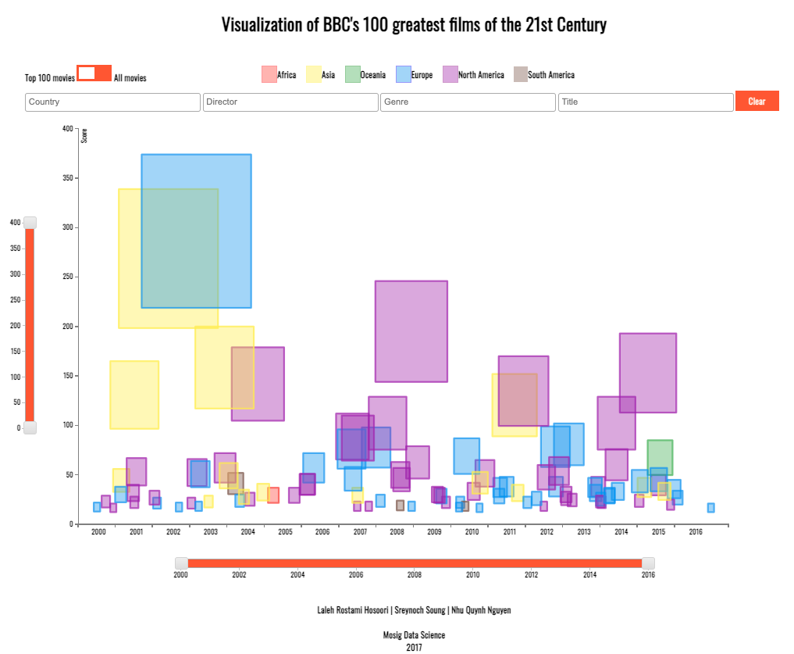

# Visualization of Top 100 Movies
This application is in JavaScript and uses [D3.js](https://d3js.org/) library.

Here is a screenshot of the visualization :

## Objectives
1. Easily recognize high ranked movies and their continent of origin
2. Filter the movies by one or multiple factors:
   1. Country
   2. Director 
   3. Genre
   4. Title 
   5. Year
   6. Score
3. Get the detailed information of each movie
   1. Score distribution over the critic continents
   2. Exact score, Title, Director, Release Date, Genre, Country

## Questions Answered 
1. What are the top 100 movies in BBC rankings according to the total score they got from the critics?
2. What are the total score and release date of each movie among all movies rated in BBC rankings?
3. What continent each movie is from?
4. What are the information details of each movie?
   e.g. title, director, year, genre, country, exact score, released date
5. What is the score distribution of each movie over the critics of each continent?
6. What are the movies by a country (or more), genre (or more), director (or more)?
7. Which movies are made in a specific range of years, range of scores?